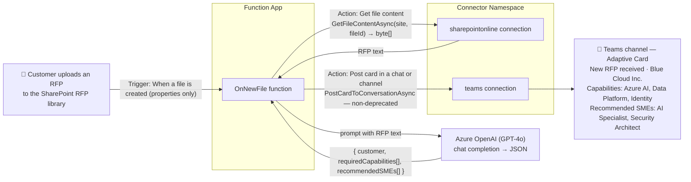
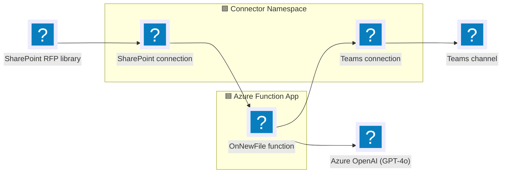

# RFP Intake — SharePoint → Azure OpenAI → Teams (.NET)

> A customer submits an RFP document to a shared SharePoint library. An Azure Function picks it
> up, an AI model extracts the requirements, and a summary card is posted to a Microsoft Teams
> channel so the right people can respond.

This is a self-contained Azure Functions app (.NET 10 isolated) built on the
[Azure Functions Connector extension](https://github.com/Azure/azure-functions-connector-extension)
and the [Azure Connectors .NET SDK](https://github.com/Azure/Connectors-NET-SDK). It uses a
**Connector Namespace** with two connections (SharePoint Online + Microsoft Teams), authorized by
the function app's **managed identity** — no shared secrets in code.

## End-to-end flow



### Architecture



### Step by step

| # | Stage | How |
|---|-------|-----|
| 1 | **RFP arrives** | A file is uploaded to the monitored SharePoint document library. |
| 2 | **Trigger** | The Connector Namespace polls the SharePoint **"When a file is created (properties only)"** trigger (`GetOnNewFileItems`) and calls the function's callback (`OnNewFile`). |
| 3 | **Fetch content** | The function calls the SharePoint **"Get file content"** action (`SharePointOnlineClient.GetFileContentAsync`) using the file identifier from the trigger payload. |
| 4 | **Extract requirements** | The RFP text is sent to **Azure OpenAI** (GPT-4o), which returns structured JSON: `customer`, `requiredCapabilities`, `recommendedSMEs`. |
| 5 | **Notify** | The function builds an Adaptive Card and posts it to a Teams channel with the **"Post card in a chat or channel"** action (`TeamsClient.PostCardToConversationAsync`). |

> **Why a separate "Get file content" call?** The only SharePoint triggers that return file
> *content* ("…in a folder") are **deprecated**. The supported "properties only" trigger returns
> metadata, so — per the [connector reference](https://learn.microsoft.com/connectors/sharepointonline/#triggers)
> — we add a **Get file content** action. All connector operations used here are non-deprecated.

## Project layout

```
connectors-integrated-demo/
├── Program.cs               # DI: SharePoint + Teams SDK clients, Azure OpenAI client (managed identity)
├── RfpFunctions.cs          # OnNewFile: trigger → get content → OpenAI → post Teams card
├── host.json
├── azure.yaml               # azd config + post-deploy hook
├── rfpApp.csproj
├── local.settings.json.sample
├── Architecture.md          # deep-dive platform architecture (connectors × functions)
├── sample-data/
│   └── bluecloud-rfp.txt    # Text-style sample RFP to upload for testing
├── docs/                    # local-run commands + Visio prompt
└── infra/
    ├── main.bicep           # Function app, storage, App Insights, namespace, OpenAI, app settings
    ├── connectorNamespace.bicep  # SharePoint + Teams connections + MI access policies
    ├── openai.bicep         # Azure OpenAI account + GPT-4o deployment + role assignment
    ├── main.parameters.json
    └── scripts/postdeploy.ps1    # Creates the trigger config + OAuth-authorizes both connections
```

## Prerequisites

- [Azure Developer CLI (`azd`)](https://learn.microsoft.com/azure/developer/azure-developer-cli/install-azd)
- [Azure CLI (`az`)](https://learn.microsoft.com/cli/azure/install-azure-cli) ≥ 2.75.0
- [.NET 10 SDK](https://dotnet.microsoft.com/download)
- [`connector-namespace` Azure CLI extension](https://github.com/Azure/Connectors/tree/main/public-preview/connector-namespace-cli):

  ```pwsh
  irm https://aka.ms/connector-namespace-cli-install-ps | iex
  ```

- A SharePoint site + document library to receive RFPs.
- A Microsoft Teams **team (group) ID** and **channel ID** to post to. The Teams **Workflows**
  app must be allowed in the Teams admin center (required by the card-posting action). Posting to
  **private channels is not supported**.

## Deploy

```pwsh
azd auth login
az login

azd env new rfp-demo
azd env set SHAREPOINT_SITE_URL "https://contoso.sharepoint.com/sites/RFPs"
azd env set SHAREPOINT_LIBRARY_NAME "Documents"
azd env set TEAMS_TEAM_ID    "<your-team-group-id>"
azd env set TEAMS_CHANNEL_ID "<your-channel-id>"

azd up
```

`azd up` provisions the infra and then runs `infra/scripts/postdeploy.ps1`, which:

1. Creates the SharePoint trigger config on the Connector Namespace (callback → `OnNewFile`).
2. Opens a browser to OAuth-authorize the **SharePoint** connection.
3. Opens a browser to OAuth-authorize the **Teams** connection.

## Test

1. Upload `sample-data/bluecloud-rfp.txt` to the monitored SharePoint library.
2. Within the trigger's polling interval (~5 min), the function runs.
3. A **"New RFP received"** Adaptive Card appears in your Teams channel:

   ```
   📄 New RFP received
   Customer:      Blue Cloud Inc.
   Source file:   bluecloud-rfp.txt

   Required capabilities
   - Azure AI
   - Data Platform
   - Identity

   Recommended SMEs
   - AI Specialist
   - Security Architect
   ```

4. Tail logs to follow each stage:

   ```pwsh
   az functionapp log tail -g <resource-group> -n <function-app>
   ```

> This sample assumes **text-style RFPs** (`.txt` / `.md`). Binary formats (PDF, DOCX) would need a
> document-extraction step (e.g. Azure AI Document Intelligence) before the Azure OpenAI call — not
> included here.

## Clean up

```pwsh
azd down --purge
```

## How auth works (no secrets)

| Component | Role |
|---|---|
| **Function-app user-assigned MI** | Calls the SharePoint + Teams connection runtime URLs and Azure OpenAI. Granted an access policy on each connection and `Cognitive Services OpenAI User` on the OpenAI account. |
| **Connector Namespace system MI** | Polls the SharePoint trigger and delivers callbacks. |
| **Callback authorization** | The connector `connector_extension` system key on the callback URL (default). This sample does **not** use App Service built-in auth. |

## Related

- [Azure Functions Connector extension](https://github.com/Azure/azure-functions-connector-extension) — the trigger binding used here.
- [Azure Connectors .NET SDK](https://github.com/Azure/Connectors-NET-SDK) — typed clients for SharePoint, Teams, and other connectors.
