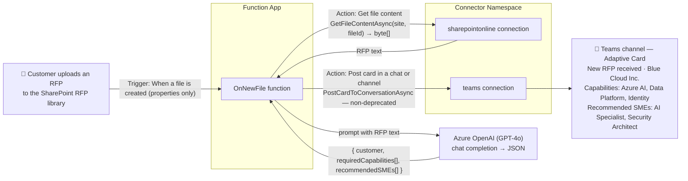
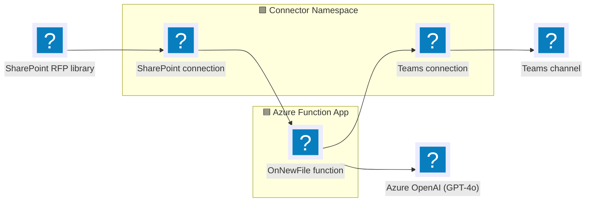

# Automated RFP Intake with SharePoint, Azure OpenAI, and Teams

> A customer submits an RFP document to a shared SharePoint library. An Azure Function picks it
> up, an AI model extracts the requirements, and a summary card is posted to a Microsoft Teams
> channel so the right people can respond.

This .NET sample shows how to implement the scenario above using the
[Azure Functions Connector extension](https://github.com/Azure/azure-functions-connector-extension)
and the [Azure Connectors .NET SDK](https://github.com/Azure/Connectors-NET-SDK). It uses two
connections, SharePoint Online and Microsoft Teams, created in an
[Azure Connector Namespace](https://learn.microsoft.com/azure/connector-namespace/connector-namespace-overview),
and leverages the function app's managed identity for authentication.

## End-to-end flow



### Architecture



## Prerequisites

- [Azure Developer CLI (`azd`)](https://learn.microsoft.com/azure/developer/azure-developer-cli/install-azd)
- [Azure CLI (`az`)](https://learn.microsoft.com/cli/azure/install-azure-cli) ≥ 2.75.0
- [.NET 10 SDK](https://dotnet.microsoft.com/download)
- [`connector-namespace` Azure CLI extension](https://github.com/Azure/Connectors/tree/main/public-preview/connector-namespace-cli)
- [Visual Studio Code](https://code.visualstudio.com/)
- A SharePoint site + document library to receive RFPs.
- A Microsoft Teams **team** and **channel** to post to. The Teams **Workflows**
  app must be allowed in the [Teams admin center](https://admin.teams.microsoft.com/policies/manage-apps)
  (required by the card-posting action)

  > **Note:** Posting to **private channels is not supported**.

## Provision resources
1. Clone the repo:
    ```pwsh
    git clone https://github.com/Azure-Samples/functions-connectors-net-rfp-intake-sharepoint-teams.git
    ```

2. Open a terminal and log in to Azure:

    ```pwsh
    azd auth login
    az login
    ```

3. Inside the root directory, create an `azd` environment. This becomes the resource group name:

    ```pwsh
    azd env new rfp-demo
    ```

4. Provision resoures:

    ```pwsh
    azd provision
    ```

    You get prompted for these values:

    | Prompt | Example value | Explanation |
    |---|---|---|
    | Azure Subscription| `00000000-0000-0000-0000-000000000000`| Resources will be provisioned in this subscription. |
    | Location | `East US 2` | The region where resources will be deployed in. |
    | `SHAREPOINT_SITE_URL` | `https://contoso.sharepoint.com/sites/RFPs` | URL of the SharePoint site containing the document library to monitor. |
    | `SHAREPOINT_LIBRARY_NAME` | `Documents` | Name of the SharePoint document library containing the RFP files. This is not a folder name. |
    | `TEAMS_TEAM_ID` | `00000000-0000-0000-0000-000000000000` | Microsoft 365 group ID of the Teams team that receives the summary card. |
    | `TEAMS_CHANNEL_ID` | `19:example-channel-id@thread.tacv2` | ID of the channel within that team that receives the summary card. |

## Test locally

### Authenticate connections

1. Go to the [Connector Namespace portal](https://connectors.azure.com) and open the namespace
   created by `azd provision`.
2. Open **Connections**. The SharePoint and Teams connections initially show an authentication
   status of `Error`. Use the authentication button for each connection and complete the sign-in
   flow.

### Run the app locally

1. Enter the required values in `local.settings.json`. The SharePoint and Teams connection runtime
   URLs are available on their connection pages in the Connector Namespace portal.

   > **Note:** Leave `AZURE_CLIENT_ID` empty when running locally. `DefaultAzureCredential` then
   > uses the developer identity from `az login`. The managed identity client ID is only used by
   > the deployed Function App.

   To find your Teams team ID, list the teams you have joined:

   ```pwsh
   az rest --method get \
     --url "https://graph.microsoft.com/v1.0/me/joinedTeams" \
     --query "value[].{name:displayName,teamId:id}" -o table
   ```

   Then use the team ID to list its channels:

   ```pwsh
   az rest --method get \
     --url "https://graph.microsoft.com/v1.0/teams/<team-id>/channels" \
     --query "value[].{name:displayName,channelId:id}" -o table
   ```

2. Start the app with authentication enabled:

   ```pwsh
   func start --enableAuth
   ```

   > **Note:** Always use `--enableAuth` when exposing your app through a dev tunnel. Without it,
   > your function endpoint is completely unauthenticated on the public internet.

3. In VS Code, open the integrated terminal with **Control+Shift+`** on macOS or
   **Ctrl+Shift+`** on Windows. Open the **Ports** view in the Panel region, then select
   **Forward a Port**.
4. Enter port `7071`. Port forwarding starts, and the **Ports** view displays a
   **Forwarded Address**, such as `https://<id>-7071.uks1.devtunnels.ms`.
5. If you haven't previously signed in to GitHub from VS Code, complete the sign-in prompt.
6. Right-click port `7071`, then select **Port Visibility → Public**. Public ports don't require
   sign-in. Select **Continue** in the confirmation dialog.

## Upload file 

1. Upload `sample-data/bluecloud-rfp.txt` to the monitored SharePoint library.
2. The function runs within the trigger's polling interval (~5 min).
3. A **"New RFP received"** Adaptive Card appears in your Teams channel:

   ```
   📄 New RFP received
   Customer:      Blue Cloud Inc.
   Source file:   bluecloud-rfp.txt

   Required capabilities
   - Azure AI
   - Data Platform
   - Identity

   Recommended SMEs
   - AI Specialist
   - Security Architect
   ```

> **Note:** This sample assumes **text-style RFPs** (`.txt` / `.md`). Binary formats (PDF, DOCX) would need a
> document-extraction step (e.g. Azure AI Document Intelligence) before the Azure OpenAI call, which is **not** included in the sample.

## Deploy to Function App to Azure
1. Deploy:

    ```pwsh
    azd deploy
    ```

2. After app is deployed, a post deployment script (`infra/scripts/postdeploy.ps1`) runs to open a browser for authenticating the **SharePoint** and **Teams** connections. For each OAuth authorization page, select **I have verified this request and trust the source**, then click **Allow access**.

### What happens in the process

| # | Stage | How |
|---|-------|-----|
| 1 | **RFP arrives** | A file is uploaded to the monitored SharePoint document library. |
| 2 | **Trigger** | The Connector Namespace polls the SharePoint **"When a file is created"** trigger (`GetOnNewFileItems`) and calls the function's callback (`OnNewFile`). The trigger returns **properties** only, so the content needs to be fetched separately. |
| 3 | **Fetch content** | The function calls the SharePoint **"Get file content"** action (`SharePointOnlineClient.GetFileContentAsync`) using the file identifier from the trigger payload. |
| 4 | **Extract requirements** | The RFP text is sent to **Azure OpenAI** (GPT-4o), which returns structured JSON: `customer`, `requiredCapabilities`, `recommendedSMEs`. |
| 5 | **Notify** | The function builds an Adaptive Card and posts it to a Teams channel with the **"Post card in a chat or channel"** action (`TeamsClient.PostCardToConversationAsync`). |

## Clean up

```pwsh
azd down --purge
```

## How auth works (no secrets)

| Component | Role |
|---|---|
| **Function-app user-assigned MI** | Calls the SharePoint + Teams connection runtime URLs and Azure OpenAI. Granted an access policy on each connection and `Cognitive Services OpenAI User` on the OpenAI account. |
| **Connector Namespace system MI** | Polls the SharePoint trigger and delivers callbacks. |
| **Callback authorization** | The connector `connector_extension` system key on the callback URL (default). This sample does **not** use App Service built-in auth. |

## Project layout

```
connectors-integrated-demo/
├── Program.cs               # DI: SharePoint + Teams SDK clients, Azure OpenAI client (managed identity)
├── RfpFunctions.cs          # OnNewFile: trigger → get content → OpenAI → post Teams card
├── host.json
├── azure.yaml               # azd config + post-deploy hook
├── rfpApp.csproj
├── local.settings.json.sample
├── Architecture.md          # deep-dive platform architecture (connectors × functions)
├── sample-data/
│   └── bluecloud-rfp.txt    # Text-style sample RFP to upload for testing
├── docs/                    # local-run commands + Visio prompt
└── infra/
    ├── main.bicep           # Function app, storage, App Insights, namespace, OpenAI, app settings
    ├── connectorNamespace.bicep  # SharePoint + Teams connections + MI access policies
    ├── openai.bicep         # Azure OpenAI account + GPT-4o deployment + role assignment
    ├── main.parameters.json
    └── scripts/postdeploy.ps1    # Creates the trigger config + OAuth-authorizes both connections
```

## Resources

- [Azure Functions Connector extension](https://github.com/Azure/azure-functions-connector-extension) — the trigger binding used here.
- [Azure Connectors .NET SDK](https://github.com/Azure/Connectors-NET-SDK) — typed clients for SharePoint, Teams, and other connectors.
